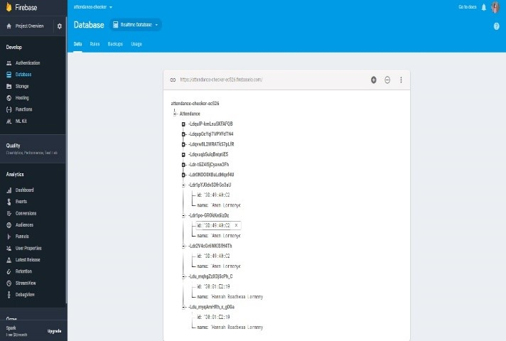
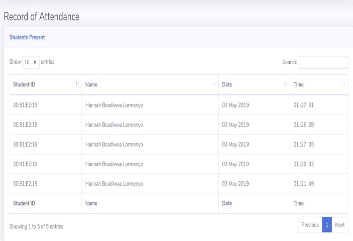

# Attendance-Checker
After my second year second semester, i believed i was not given the right scores for attendance.
Therefore i was motivated to build this advanced attendance checker for faculties to efficiently track the attendance of students.
This a project that consist of an RFID system that checks the attendance of students as they swipe their ID cards over the RFID. 

# Features
### RFID Module

### LED Seven-Segment Display

### Database

### Admin page


# Technologies used
### Arduino 
Using the Arduino IDE, compile and the upload the rfid.ino file to the arduino uno. 
This file so contains code for updating the number of students in the class at any point in time on the seven-segment display made up of LEDs and Transistors(2N3904). A common cathode configuration was used for the seven-segment display. 

### PySerial
PySerial allows serial communication between the arduino and a python script. 
The details of the students is sent via serial communication to the Python backend to push to the database.
To install it: 
``` 
pip install pyserial 
```
```
pip install serial 
```

### Firebase Database
To push the data to Firebase database, a python wrapper for firebase API must be installed. pip can be used.
```
pip install pyrebase
```
This is a code snippet for initializing the Firebase Database
```
import pyrebase

#  Initialize Firebase
config = {
    "apiKey": "xxxxxxxxxxxxxxxxxx",
    "authDomain": "attendance-checker-ec526.firebaseapp.com",
    "databaseURL": "https://attendance-checker-ec526.firebaseio.com",
    "projectId": "attendance-checker-ec526",
    "storageBucket": "attendance-checker-ec526.appspot.com",
    "messagingSenderId": "xxxxxxxxxxxxx",
    "serviceAccount": "path/to/service/account"
  }

firebase = pyrebase.initialize_app(config)

db = firebase.database()
```

To finally push the data to the database the following code is used:
```
db.child("Attendance-Record").push(
                                {"id": k,
                                "name": records[k],
                                "date": datetime.datetime.now().strftime("%d")+ " " + datetime.datetime.now().strftime("%B") + " " +            datetime.datetime.now().strftime("%Y"),
                                "time": datetime.datetime.now().strftime("%H")+ " :" + datetime.datetime.now().strftime("%M"  + " :" + datetime.datetime.now().strftime("%S"))})
```
This creates a collection called "Attendance-Record" and then creates key-value data under that collection. 

### Flask 
Flask is used to render the admin webpage that shows the record of attendance of students as in the database.

```
pip install flask 
```

# Credit 
Ashesi University
Mr. Kofi Adu-Labi
Cynthia Umwizerwa
Michael Ansah 
Kwesi Owusu Nyampong

