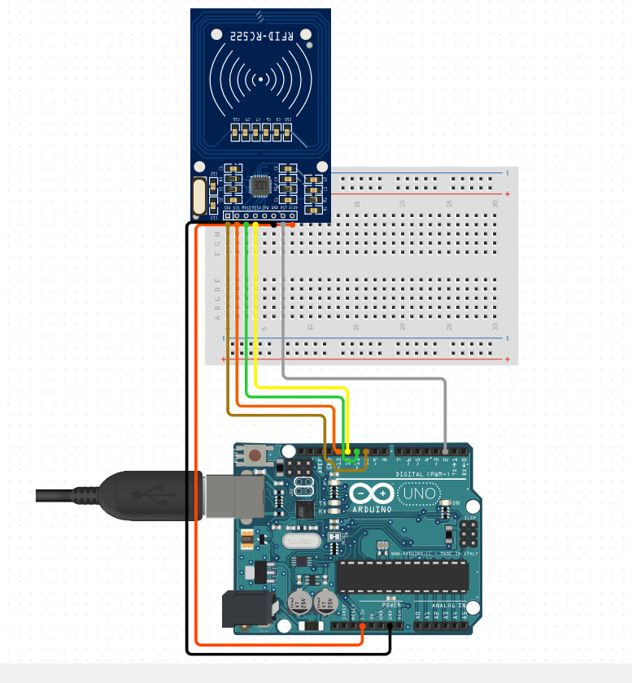
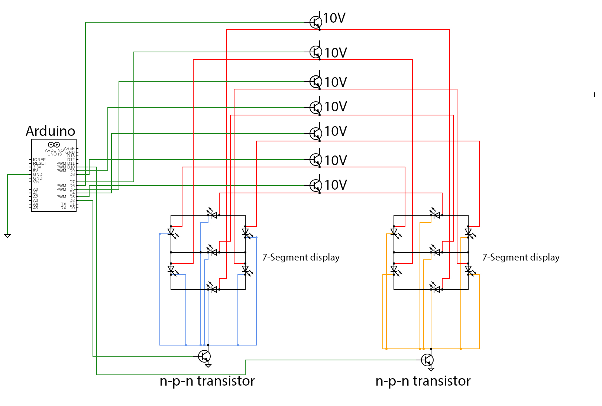

# Attendance-Checker
After my second year second semester, i believed i was not given the right scores for attendance.
Therefore i was motivated to build this advanced attendance checker for faculties to efficiently track the attendance of students.
This a project that consist of an RFID system that checks the attendance of students as they swipe their ID cards over the RFID. 

# Features
### RFID Module

### LED Seven-Segment Display

### Database

### Admin page

# Technologies used
### Arduino 
### PySerial
### Firebase Database
### Flask 

# Credit 
Ashesi University
Mr. Kofi Adu-Labi
Cynthia Umwizerwa
Michael Ansah 
Kwesi Owusu Nyampong

